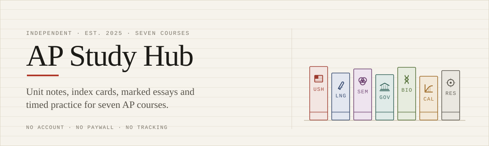

<div align="center">

  <a href="https://apstudyhub.vercel.app">
    <picture>
      <source media="(prefers-color-scheme: dark)" srcset="./assets/readme/banner-dark.svg" />
      
    </picture>
  </a>

  <p>
    <a href="https://apstudyhub.vercel.app"></a>
    
    
    
    <br />
    
    
    
    
  </p>

</div>

Unit notes, the cards I drilled on the bus, and sample essays with the rubric points
marked in the margin. I sat these exams. This is what I wish had existed.

**Live at <https://apstudyhub.vercel.app>** — seven AP courses, no account, no paywall,
no tracking.

Not affiliated with the College Board. AP and Advanced Placement are their registered
trademarks, and nothing here has been reviewed or endorsed by them.

---

## 01 — The catalogue

Every number below is read out of the content at build time, not typed in by hand, so
what you see is what is actually written.

| Spine | Course | Units | Cards | Questions | Essays | Timed paper | Exam 2026 |
| :---- | :----- | ----: | ----: | --------: | -----: | ----------: | :-------- |
| `USH` | [AP United States History](https://apstudyhub.vercel.app/course/apush) | 9 | 53 | 30 | 1 | 1 | 9 May, morning |
| `LNG` | [AP English Language and Composition](https://apstudyhub.vercel.app/course/ap-lang) | 6 | 45 | 30 | 3 | 1 | 14 May, morning |
| `SEM` | [AP Seminar](https://apstudyhub.vercel.app/course/ap-seminar) | 5 | 36 | 28 | 1 | 1 | 7 May, afternoon |
| `GOV` | [AP United States Government and Politics](https://apstudyhub.vercel.app/course/ap-gov) | 5 | 20 | 15 | — | — | 5 May, afternoon |
| `BIO` | [AP Biology](https://apstudyhub.vercel.app/course/ap-bio) | 8 | 20 | 15 | — | — | 12 May, morning |
| `CAL` | [AP Calculus AB and BC](https://apstudyhub.vercel.app/course/ap-calc) | 6 | 15 | 10 | — | — | 13 May, morning |
| `RES` | [AP Research](https://apstudyhub.vercel.app/course/ap-research) | 5 | 12 | 10 | 1 | — | 30 April, morning |
| | **All seven** | **44** | **201** | **138** | **6** | **3** | 30 April – 14 May |

Coverage is deliberately uneven. Where a course has no essays or timed paper, the tab is
not rendered at all rather than shown empty — a tab advertising a gap is worse than no
tab. The live counts are on [`/about`](https://apstudyhub.vercel.app/about).

## 02 — What is on a course page

Six things, in the order you are likely to want them. Each one is its own URL, so you can
bookmark the bit you are working through instead of scrolling past the rest.

| | Mode | What it is |
| :-- | :--- | :--------- |
| `i` | **Notes** | Unit-by-unit write-ups following the College Board framework, with the key terms pulled to the top of each unit so you can self-test before you read. |
| `ii` | **Cards** | Term on the front, the answer you would actually have to produce on the back. Shuffles with a real Fisher–Yates, keyboard-driven, and it remembers the ones you got wrong. |
| `iii` | **Practice** | Multiple choice written in exam register — plausible distractors, not three obviously wrong answers — with an explanation of why each option fails. |
| `iv` | **Essays** | Full sample responses with the rubric broken out point by point: what earned the thesis mark, what earned evidence, what would have earned sophistication. |
| `v` | **Timed paper** | The full-length format with a running clock and the source documents embedded, so you find out how long forty minutes really is before it counts. |
| `vi` | **Sources** | Links out to College Board material, archives and the teachers worth watching. Every link was opened by a person before it was added. |

## 03 — Running it

Requires Node 20.9+ and pnpm.

```bash
pnpm install
pnpm dev          # http://localhost:3000

pnpm typecheck    # tsc --noEmit
pnpm lint         # eslint
pnpm build        # production build
pnpm check        # all three, in that order
```

There is no database, no CMS and no environment file to create. `NEXT_PUBLIC_SITE_URL`
is the only variable the app reads, and it only affects canonical URLs and the sitemap;
without it the production domain is assumed.

## 04 — How the repo is laid out

<details>
<summary>Open the file map</summary>

<br />

```text
assets/readme/              the two banners above, and the script that draws them
src/
  app/
    layout.tsx              root shell: metadata, fonts, header, footer, JSON-LD
    page.tsx                home
    globals.css             design tokens, @font-face, component classes
    course/[slug]/          one course, seven child routes
      layout.tsx              course shell: breadcrumbs, countdown, tabs
      page.tsx                overview
      notes/                  unit notes, server-rendered
      cards/                  flashcard deck
      practice/               multiple-choice sets
      essays/                 sample responses with the rubric alongside
      exam/                   timed paper
      resources/              checked links
    search/                 server-rendered results (works with JavaScript off)
    guides/ about/ colophon/ privacy/ accessibility/
    api/search/route.ts     JSON endpoint for the header combobox
    sitemap.ts robots.ts manifest.ts icon.tsx apple-icon.tsx opengraph-image.tsx
  components/               14 components, all hand-written, no UI library
  lib/
    data.ts                 all course content
    catalog.ts              joins content to subjects, computes the counts above
    subjects.ts             the seven courses: colour, exam date, metadata
    search.ts               scored index over the content
    channels.ts             YouTube channels, each with a date it was checked
    markdown.tsx            the small subset of Markdown the notes use
    schema.tsx              JSON-LD builders
    site.ts                 origin, names, dates
public/fonts/               four self-hosted variable WOFF2 files + licences
```

</details>

## 05 — Notes on the build

- **Static.** Every content page is generated at build time. The only dynamic route is
  `/api/search`.
- **Reads with JavaScript off.** Search is server-rendered; only the deck and the
  countdown need the client.
- **No UI library.** No component kit, no icon package. Every glyph is hand-drawn SVG on
  a 32-unit grid; every control is a native element.
- **Three self-hosted typefaces.** Newsreader, Public Sans and JetBrains Mono,
  latin-subset variable WOFF2, about 192 KB total. Nothing is requested from a font CDN.
  Licences are in `public/fonts/`.
- **No client-side data fetching.** Content is imported as TypeScript modules, so it is
  type-checked and it ships in the HTML.
- **Three localStorage keys**, all of them the reader's own study state. They are listed
  and explained on [`/privacy`](https://apstudyhub.vercel.app/privacy).

Design decisions are written up on [`/colophon`](https://apstudyhub.vercel.app/colophon);
accessibility conformance and known defects are on
[`/accessibility`](https://apstudyhub.vercel.app/accessibility).

## 06 — Contributing

Corrections are the most useful contribution — the notes compress a lot and some of it
will be wrong. [Open an issue](https://github.com/Nikoxkx/Ap-Study-Hub/issues) with the
page address and what is wrong with it, and it gets fixed and the content revision in the
footer gets bumped.

If you want to add content, keep the existing shape: everything lives in
`src/lib/data.ts`, keyed by course slug, and anything with a URL needs a date recording
when a human last opened it.

## Licence

Code is MIT. Course content is © the author, and the bundled typefaces are under the SIL
Open Font License 1.1 (licence text in `public/fonts/`).

---

<div align="center">
  <sub>
    AP Study Hub · Independent · Not affiliated with or endorsed by the College Board<br />
    AP and Advanced Placement are registered trademarks of the College Board.
  </sub>
</div>
